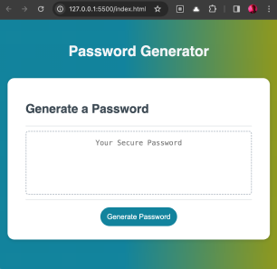
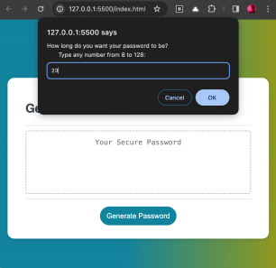
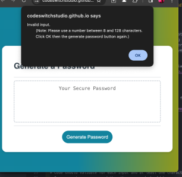
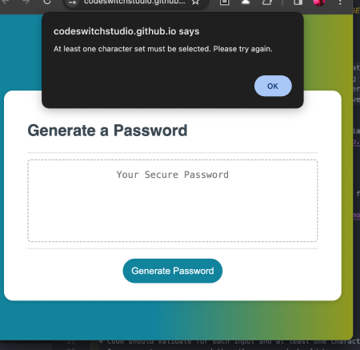

# password-generator

## Description
This is an application for generating a random password based on the user's preferred length (between 8-128 characters) and selected character sets (namely, uppercase, lowercase, numbers, and special characters). This will run in the browser, and features dynamically updated HTML and CSS powered by JavaScript. I aim to make a clean and polished user interface that is responsive, ensuring that it adapts to multiple screen sizes.

## Screenshots
Initial Screen

Initial Prompt

If wrong input

If no character set chosen

Generated password sample

## Link to deployed app
https://codeswitchstudio.github.io/password-generator/

## Credits
This challenge would not have been completed without tutoring from Samuel Cordova and the pseudo code from our instructor Laura Cole.

Gradients from 
https://cssgradient.io/
